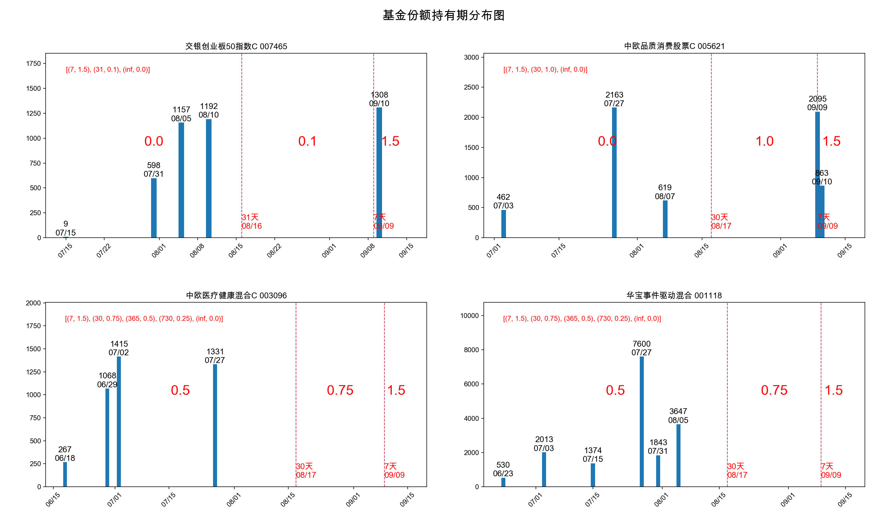

# 基金赎回费率计算工具
## 介绍
该python工具用来生成基金的持有份额的持有天数以及赎回费率的分布图表，便于选择尽可能低的费率赎回基金。

如上图，从左上第一张小图[交银创业板50指数C]中，可以读出的信息：

- 赎回费率为0%的份额有：9+598+1157+1192 = 2956份；
- 赎回费率为1.5%的份额有：1308份
- 赎回费率：持有期<7天 为1.5%； 7天<=持有期 <31天 为 0.1%； 持有期  >=31天为0% 

则在需要申请赎回的时候，便可先最大赎回2956份，可以避免持有期过短所带来的高费率损失。

## 环境与依赖

- python3
- 运行需要先使用`pip3`安装`matplotlib`, `numpy`, `pandas`, `bs4`等模块
- 需要接入因特网，脚本会访问[天天基金](http://fund.eastmoney.com/)网爬取基金名字与赎回费率

ps: 本项目在Max/Windows下测试通过，其它平台未进行验证

## 开始使用

1. **获取代码**: `git clone https://github.com/leytou/FundsDateViewer.git`
2. **填写基金信息**:  请在`src/data.xlsx`中填写你历史的基金买入卖出的份额信息，注意日期用的是份额确认的日期。
3. **运行脚本**: `cd src && python3 main.py`

## 其它说明
- 注意在`data.xlsx`中填写份额时使用的日期是买或卖的**份额确认**的日期，不是申请买或卖的日期
- 份额使用**取整**，去掉小数，如`1234.65`, 则写为`1234`份
- 该工具是脑子一热匆匆忙忙写的，代码风格惨不忍睹敬请原谅。

## 重要声明
本工具仅供学习交流使用，避免用作其它用途，若因使用该工具所造成的一切损失，应由使用者承担。

